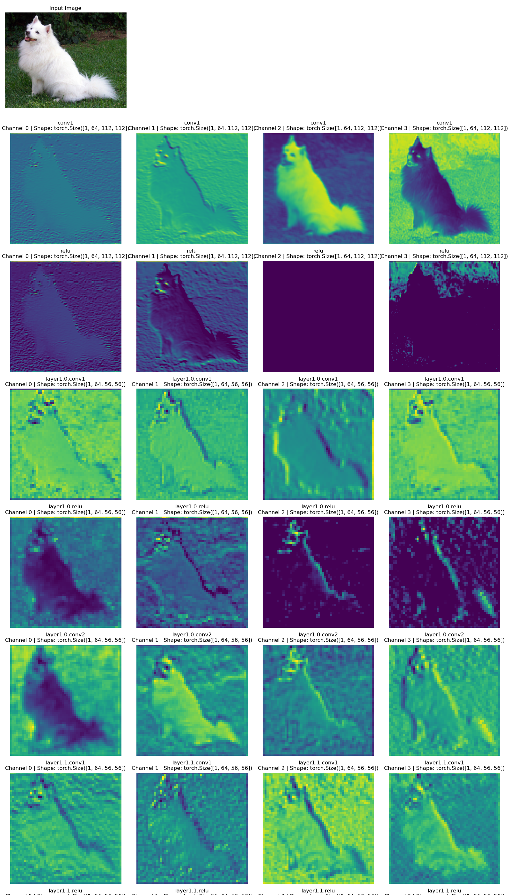

# torch-anatomy
### Visualize what your CNN sees, layer by layer
---


[](https://pypi.org/project/torch-anatomy/)
[](LICENSE)

---

# 🚀 What is torch-anatomy?

**torch-anatomy** is an open-source Python tool that lets you peek inside any PyTorch CNN (Convolutional Neural Network) model and see what’s happening at every layer—step by step.

## Why does this matter?

Have you ever wondered:
- *“How does my neural network actually understand an image?”*
- *“What is happening inside each layer, not just at the input and output?”*

**torch-anatomy** helps you answer these questions by visualizing the “thought process” of your model. It shows you the feature maps (also called activations) at each key layer, so you can literally see what your model is “looking at” as it processes an image.

## Who is it for?

- **Students & Beginners:**  
  Learn how CNNs work, not just in theory but by seeing real visualizations.
- **Engineers & Developers:**  
  Debug and improve your models by understanding which features each layer is detecting.
- **Researchers:**  
  Make your models more interpretable and transparent.
- **Educators:**  
  Use live demos to make deep learning concepts engaging and clear for your students.

## What does torch-anatomy do?

- Works with any PyTorch CNN model (ResNet, VGG, custom models, etc.)
- Visualizes feature maps for important layers (Conv, ReLU, Pool, etc.)
- Use it with a single line of Python or from the command line
- Save or display the visualizations as heatmaps or grayscale images

## Example

- **Input:** An image of a dog
- **Output:**  
  - Early layers: Edges and textures  
  - Middle layers: Patterns and shapes  
  - Deeper layers: Abstract features (what the model “thinks” is important)

You can literally see what your model is focusing on at every step!

---

**torch-anatomy** turns deep learning from a “black box” into a “glass box”—so you can see, learn, and trust what’s happening inside.

---

## 📦 Install

```bash
pip install torch-anatomy
```

---

## 🧑‍💻 Quick Usage

```python
from torch_anatomy import visualize_layers
from torchvision import models

model = models.resnet18(pretrained=True)
visualize_layers(
    model=model,
    input_image='dog.jpg',
    layers_to_show=['Conv2d', 'ReLU'],
    channels_per_layer=6,
    colormap='inferno',
    show_colorbar=True
)
```

Or from CLI:

```bash
torch-anatomy --model resnet18 --image dog.jpg
```

---
## 🖼️ Examples Screenshots

---

## 🔗 Links

- [PyPI Package](https://pypi.org/project/torch-anatomy/)
- [Main Code Repository](https://github.com/harsk03/torch-anatomy) (private repo for now !)
- [Jupyter Notebook Example](examples/demo.ipynb)

---

## 🙌 Contribute & Feedback

- Issues, suggestions, and PRs welcome!
- Contact: harshalkale2402@gmail.com or open an issue

---

## 📝 License

MIT
